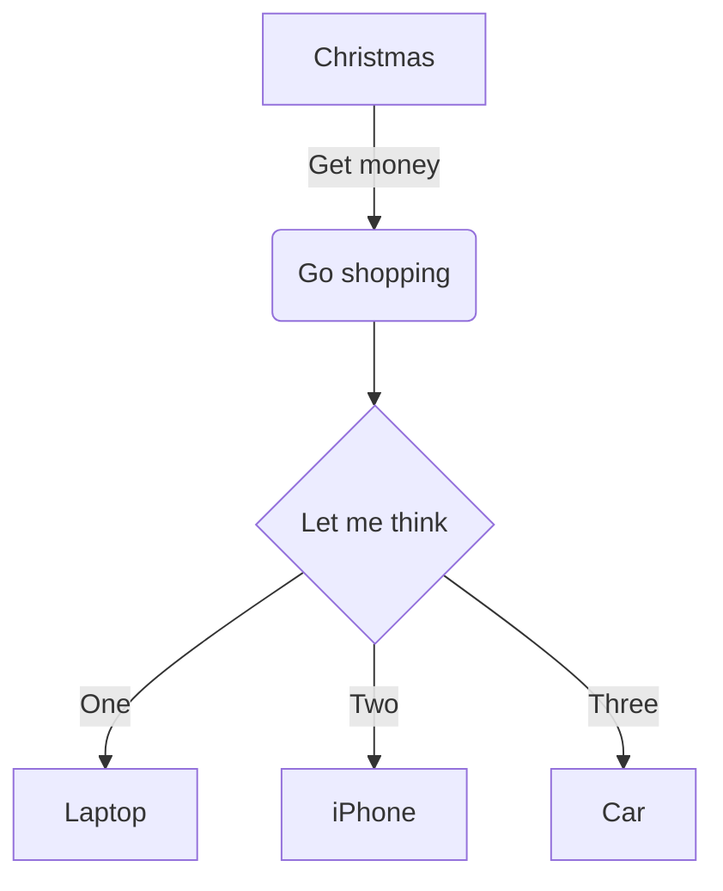

## 如何改变文本的样式
== 标记文本 ==
*强调文本* _强调文本_

**加粗文本** 
__加粗文本__
123444_2_33

`==标记文本==`

~~删除文本~~

> 引用文本

H-2-O is是液体。

2<sup>10</sup> 运算结果是 1024.

2^2^  

## 创建一个表格
| 1  | 2  |
|---|---|
| 1  | **nicely** |

```katex
    \sum_{i=1}^n a_i=0 
```


```php
    <?php
      echo "hello, world!";
    ?>
```

